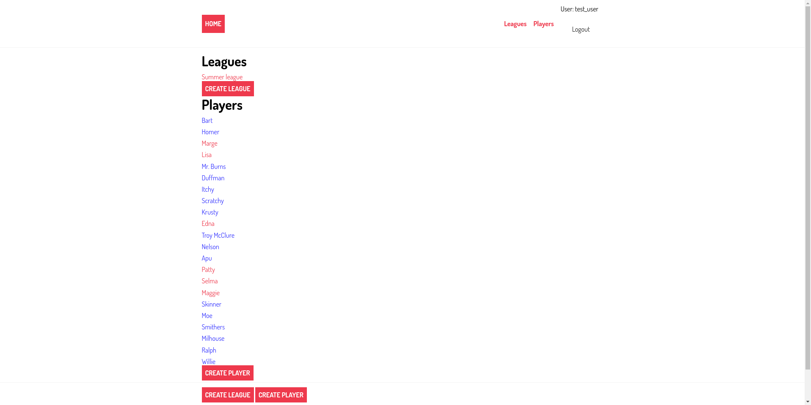
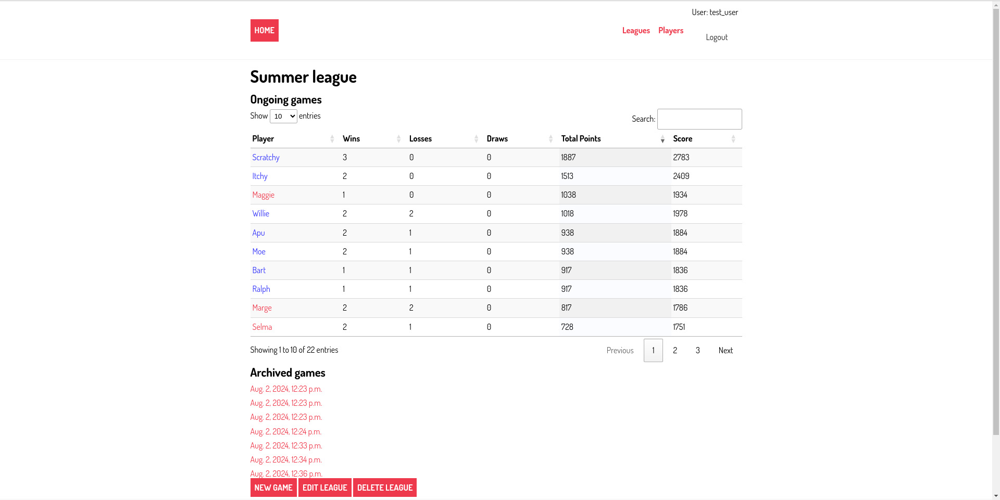
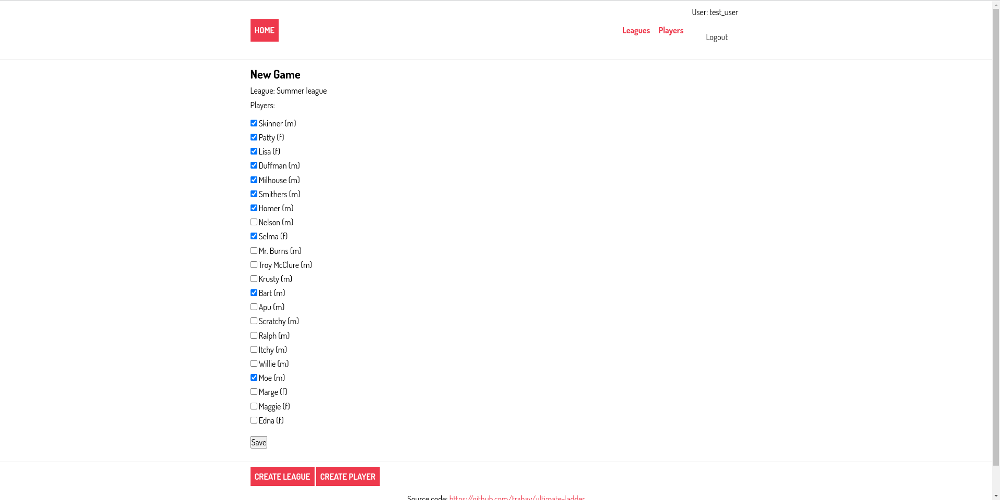
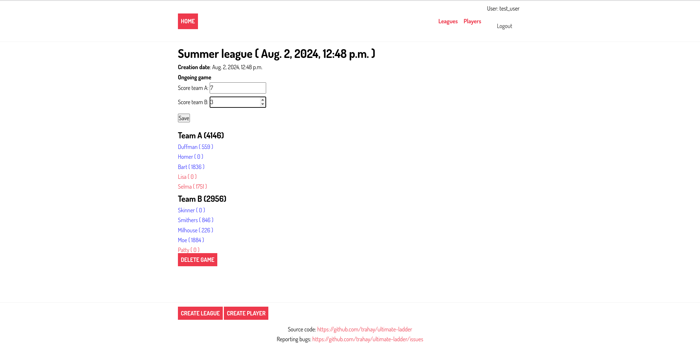

# ultimate-ladder
A matchmaking website for creating balanced teams when playing ultimate frisbee


## Usage

First, you need to initialize stuff using the `init.sh` script:
```
bash  init.sh 
```

Then, you can start the server by running:
```
bash run.sh
```

Now, you can access the website at this address: http://127.0.0.1:8000/ultimate_ladder

The admin interface is located at : http://127.0.0.1:8000/admin


# Running in Docker

First, initialize the submodules:
```
git submodule init
git submodule update
```

Then, create `.env` by adapting `.env.sample` to your configuration.

```
cp .env.sample .env
nano .env
[...]
```

Then, start the containers with:
```
docker-compose up -d --build
```

Finally, initialize a bunch of stuff
```
docker-compose exec web python manage.py makemigrations ultimate_ladder
docker-compose exec web python manage.py migrate ultimate_ladder
docker-compose exec web python manage.py migrate
docker-compose exec web python manage.py createsuperuser
```


# Using Ultimate-ladder

First, you need to create a `League`, eg `Summer league 2024`, and a
list of players (eg. `Bart`, `Lisa`, `Homer`, ...)

The home page show the current leagues and players



Selecting a league shows the number of win/losses/draws for each player.



When creating a `New game`, select the players for the next game.



Click `save` to create the game. Two teams are created so that the
scores and gender are balanced.



After the game, enter the game score to update the players scores.
